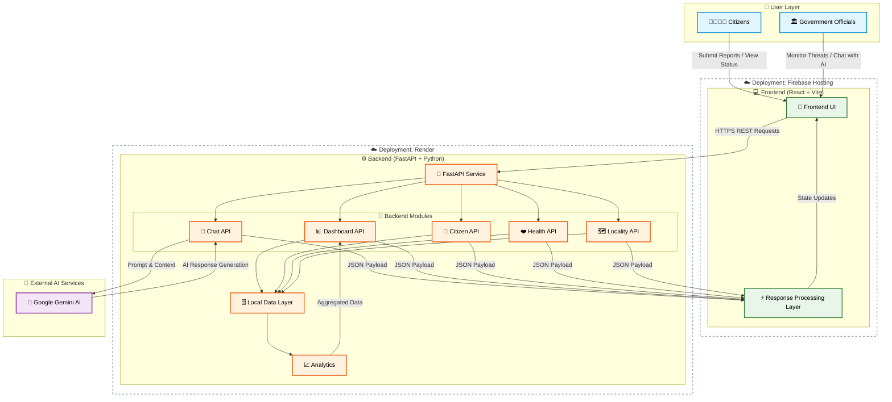

# AquaGuard AI System Architecture

```mermaid
graph TD
    subgraph UserLayer ["👤 User Layer"]
        Citizens["👨‍👩‍👧‍👦 Citizens"]
        Officials["🏛️ Government Officials"]
    end

    subgraph DeploymentFirebase ["☁️ Deployment: Firebase Hosting"]
        subgraph Frontend ["💻 Frontend (React + Vite)"]
            UI["📱 Frontend UI"]
            ResponseProcessing["⚡ Response Processing Layer"]
        end
    end

    subgraph DeploymentRender ["☁️ Deployment: Render"]
        subgraph Backend ["⚙️ Backend (FastAPI + Python)"]
            FastAPI["🚪 FastAPI Service"]
            
            subgraph BackendModules ["🔌 Backend Modules"]
                ChatAPI["💬 Chat API"]
                DashboardAPI["📊 Dashboard API"]
                CitizenAPI["📝 Citizen API"]
                HealthAPI["❤️ Health API"]
                LocalityAPI["🗺️ Locality API"]
            end
            
            LocalDataLayer["🗄️ Local Data Layer"]
            Analytics["📈 Analytics"]
        end
    end

    subgraph AIServices ["🧠 External AI Services"]
        Gemini["🤖 Google Gemini AI"]
    end

    %% User interactions
    Citizens -->|Submit Reports / View Status| UI
    Officials -->|Monitor Threats / Chat with AI| UI

    %% Frontend to Backend Request
    UI -->|HTTPS REST Requests| FastAPI

    %% Backend internal routing
    FastAPI --> ChatAPI
    FastAPI --> DashboardAPI
    FastAPI --> CitizenAPI
    FastAPI --> HealthAPI
    FastAPI --> LocalityAPI

    %% Backend to Data Layer
    DashboardAPI --> LocalDataLayer
    CitizenAPI --> LocalDataLayer
    HealthAPI --> LocalDataLayer
    LocalityAPI --> LocalDataLayer
    LocalDataLayer --> Analytics

    %% AI Integration
    ChatAPI -->|Prompt & Context| Gemini
    Gemini -->|AI Response Generation| ChatAPI

    %% Response lifecycle
    ChatAPI -->|JSON Payload| ResponseProcessing
    DashboardAPI -->|JSON Payload| ResponseProcessing
    CitizenAPI -->|JSON Payload| ResponseProcessing
    HealthAPI -->|JSON Payload| ResponseProcessing
    LocalityAPI -->|JSON Payload| ResponseProcessing
    Analytics -->|Aggregated Data| DashboardAPI

    ResponseProcessing -->|State Updates| UI

    %% Styling classes for aesthetics
    classDef users fill:#e1f5fe,stroke:#0288d1,stroke-width:2px,color:#000;
    classDef front fill:#e8f5e9,stroke:#2e7d32,stroke-width:2px,color:#000;
    classDef back fill:#fff3e0,stroke:#e65100,stroke-width:2px,color:#000;
    classDef ai fill:#f3e5f5,stroke:#7b1fa2,stroke-width:2px,color:#000;
    classDef deploy fill:#ffffff,stroke:#90a4ae,stroke-width:2px,stroke-dasharray: 5 5;

    class Citizens,Officials users;
    class UI,ResponseProcessing front;
    class FastAPI,ChatAPI,DashboardAPI,CitizenAPI,HealthAPI,LocalityAPI,LocalDataLayer,Analytics back;
    class Gemini ai;
    class DeploymentFirebase,DeploymentRender deploy;
```
